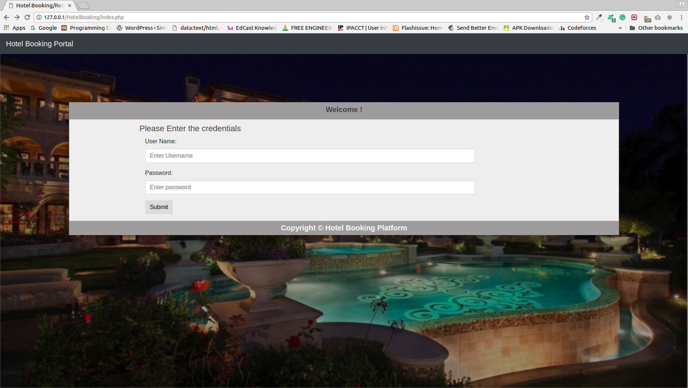
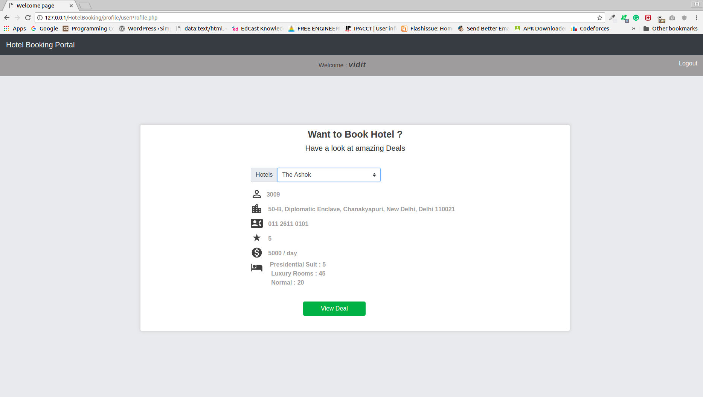
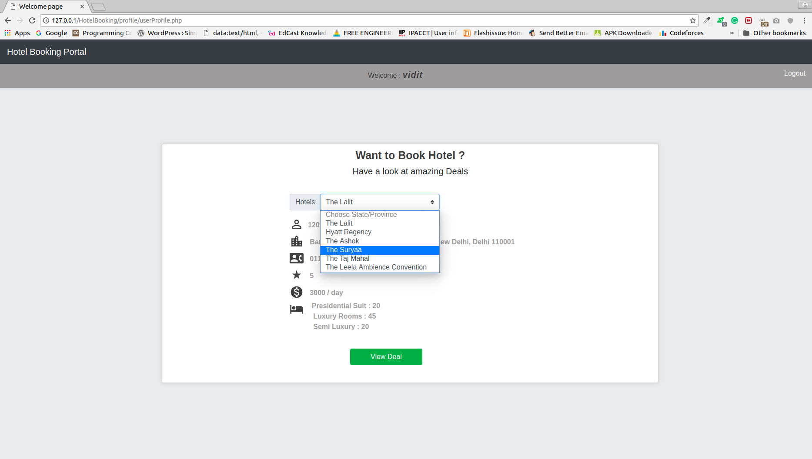
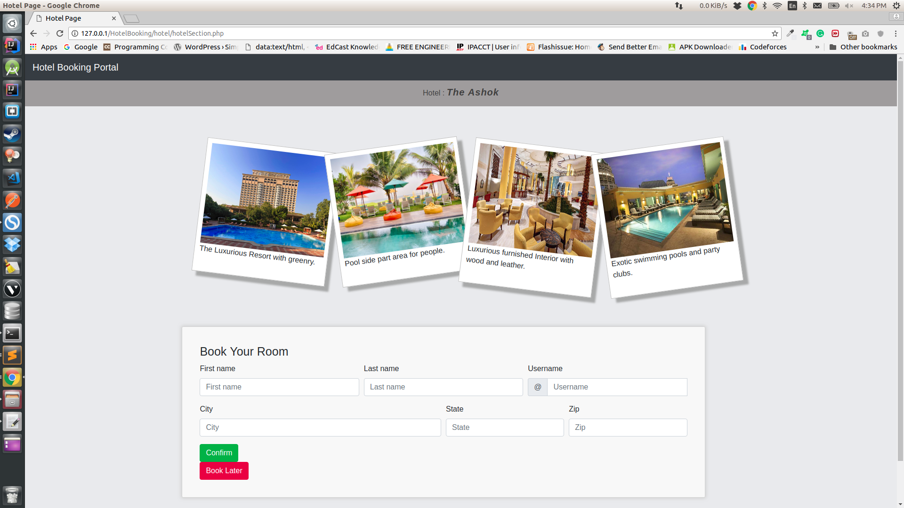
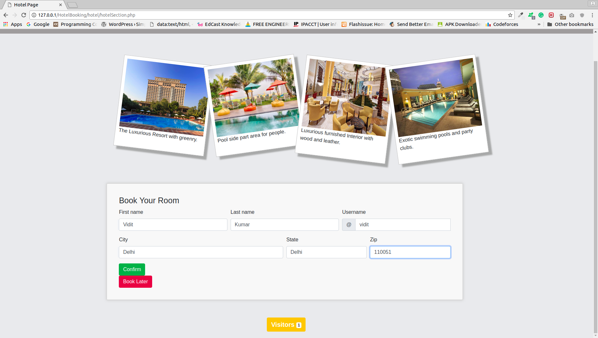
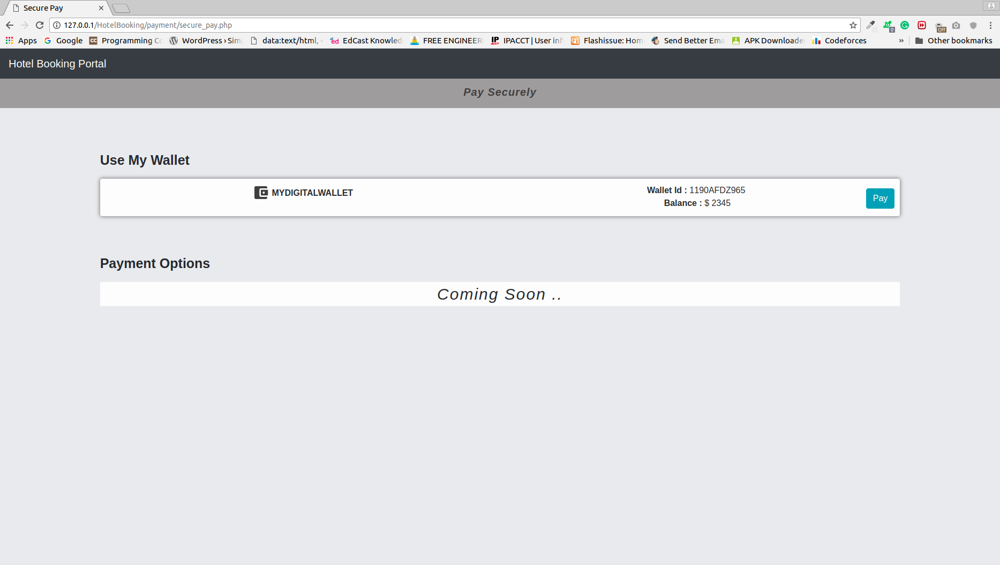
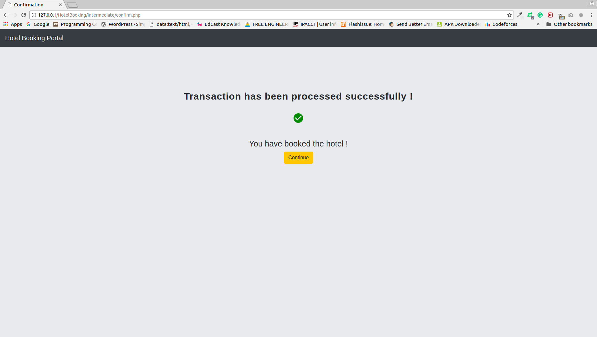

# MithyaLabTask
This repository for Mithya Lab Task

## Db configuration 
 Username : root
 password : root
 Import it into the localhost

## Technology Used :
 1) Php : For Backend
 2) HTML : for front end
 3) CSS3/BOOTSTRAP : For styling effects
 4) Jvascript
 5) Jquery/Ajax
 6) Mysql : For Database

 [/New/] In this , i have created a dummy wallet . but if you say I can integrte paypal in it (by nodejs) I have worked on it in previous projects

## How to Use :
  Pu the whole code into the `/var/www/html/` directory , if u are using linux
  For windows put in `wamp www` directory

## Few Points :
I have created a dummy user named `vidit` for using the site .
  Login credential for website :
       username : `vidit`
        password : `12345678`
 
 ## Snapshot
   1) Front Page :
 

  2 ) Profile
 .png)
 
   3 ) HotelViewing
 
 
   4 ) Hotel Fetch Json
 
 
   5 ) Hotel Booking Part
 
 
   6 ) Visitor Count
 
 
   7 ) Payment
 
 
   8 ) Hotel Booked
 
